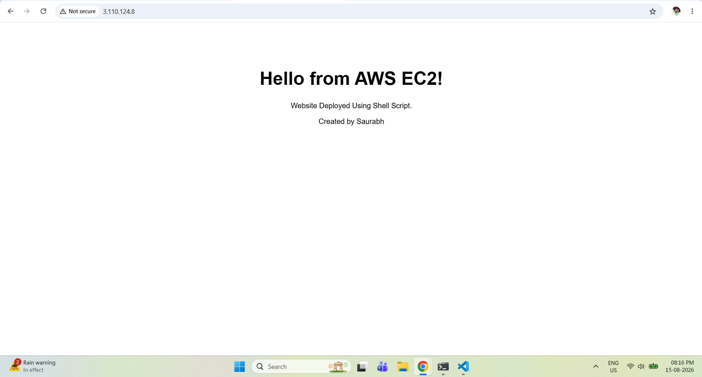
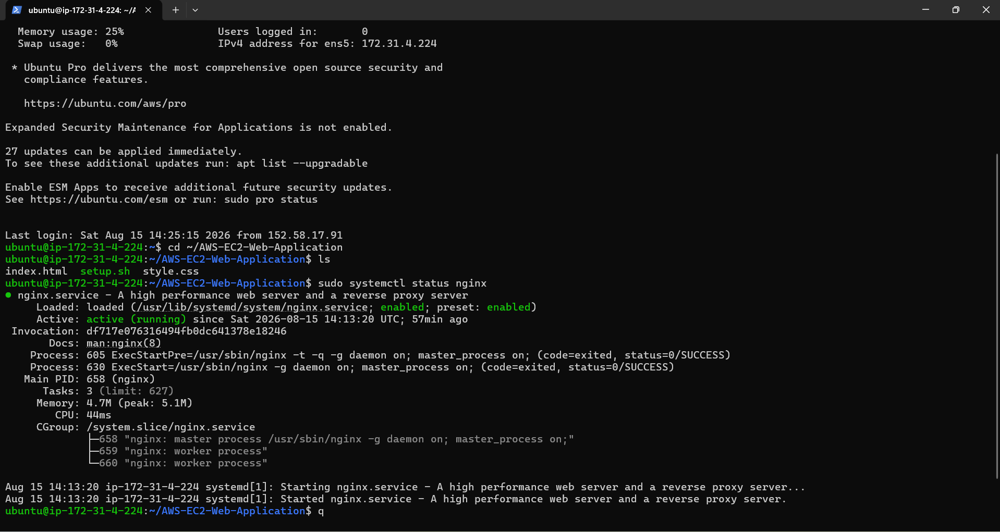
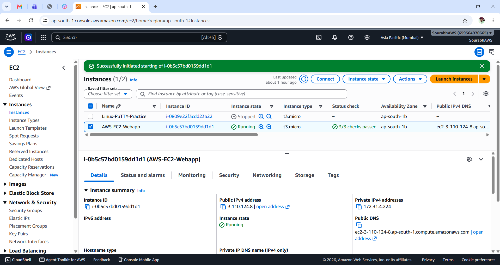
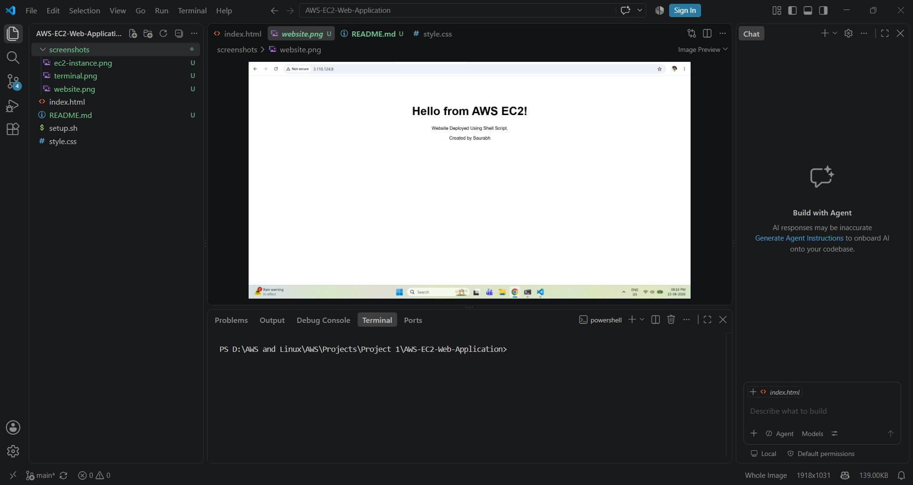

# AWS EC2 Web Application Deployment

A simple static website deployed on an AWS EC2 Ubuntu server using Nginx and automated with a Bash shell script.

---

 ## Technologies Used

- HTML
- CSS
- Git & GitHub
- Linux (Ubuntu)
- AWS EC2
- Nginx
- Bash
- SSH

---

##  Project Overview

This project demonstrates how to create a simple HTML/CSS website, manage it using Git, store the project on GitHub, deploy it on an AWS EC2 Ubuntu server, configure Nginx as the web server, and automate deployment using a Bash script.

The complete flow is:

Developer → Git → GitHub → AWS EC2 → Ubuntu → Nginx → Website

---

##  Project Objective

The main objective of this project is to understand the complete basic workflow of deploying a website to a cloud server.

Through this project, I learned:

- HTML and CSS project structure
- Git and Git repositories
- GitHub repositories
- AWS EC2
- Ubuntu Linux
- SSH
- AWS Security Groups
- Nginx
- Linux commands
- Bash scripting
- Basic deployment automation

---

## Project Structure

```text
AWS-EC2-Webapp/
│
├── index.html
├── style.css
├── setup.sh
├── README.md
└── screenshots/
    ├── website.png
    ├── terminal.png
    ├── ec2-instance.png
    └── vscode.png
```

---
##  Automation
```text
A Bash shell script named setup.sh is included in this project to automate the basic server setup and deployment process.


Automation Flow

EC2 Ubuntu Server
       │
   setup.sh
       │
       ├── Update packages
       │
       ├── Install Nginx
       │
       ├── Start Nginx
       │
       ├── Enable Nginx
       │
       └── Deploy website files


Automation reduces repetitive manual work and makes the deployment process:

- Faster
- Consistent
- Repeatable
- Easier to maintain
- Less prone to manual errors
```

---

#  Project Screenshots

## 🌐 Website Deployed on AWS EC2

This screenshot shows the final website running through the EC2 public IP.



---

## 💻 Ubuntu Terminal

This screenshot shows the Ubuntu EC2 server and deployment environment.



---

## ☁️ AWS EC2 Instance

This screenshot shows the running EC2 instance used to host the website.



---

## 🧑‍💻 VS Code Project Structure

This screenshot shows the complete project structure and files.



---
#  Architecture

                    Developer
                       │
                       │ Git
                       ▼
                 GitHub Repository
                       │
                       │ git clone
                       ▼
              ┌──────────────────┐
              │    AWS EC2       │
              │     Ubuntu       │
              └────────┬─────────┘
                       │
                       ▼
                    Nginx
                       │
                       ▼
                /var/www/html
                 │            │
                 ▼            ▼
             index.html    style.css
                       │
                       ▼
                   Port 80
                       │
                       ▼
                    Browser

                  
--- 
##  Project Summary
``` 
HTML + CSS 
↓ 
Git 
↓ 
GitHub 
↓ 
AWS EC2 
↓ 
Ubuntu 
↓ 
Nginx 
↓ 
Static Website 
↓ 
Browser

## Built with ☁️ AWS + 🐧 Linux + 🌐 Nginx + 🔧 Git + 🐚 Bash

---
##  Skills Learned

- HTML & CSS
- VS Code
- Git & GitHub
- Linux & Ubuntu
- AWS EC2
- SSH
- Security Groups
- Nginx
- Bash Scripting
```
---

## 🚀 Future Improvements

- Add a custom domain
- Enable HTTPS with SSL
- Automate deployment
- Add monitoring and logging
- Improve website design
- Use AWS services for better scalability

---
## 👨‍💻 Guided by
Sachin Bharne Sir 

---
#  Author
Sourabh R. Dhule
git add README.md